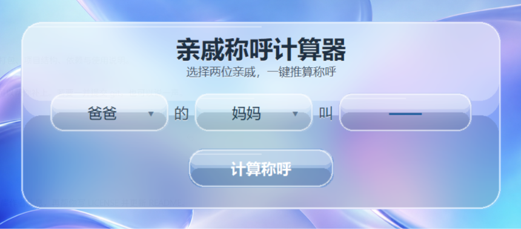

<div align="center">

# 亲戚称呼计算器

**逢年过节必备 · 再也不会叫错亲戚**

[]()
[]()
[]()

<br>



<sub>毛玻璃风格界面 · 91 个常见亲属称谓 · 语音朗读整句结果</sub>

<br><br>

[快速开始](#-快速开始) ·
[功能特点](#-功能特点) ·
[下载使用](#-下载使用) ·
[项目结构](#-项目结构) ·
[开源协议](#-开源协议)

</div>

---

## 功能特点

| | |
|:---:|:---|
| **推算称呼** | 选择两位亲戚，得到「A 的 B」该怎么叫 |
| **语音朗读** | 点击计算后朗读整句，如「爸爸的哥哥叫伯伯」 |
| **丰富词库** | 涵盖父母、祖辈、堂表亲、姻亲、孙辈等 91 项 |
| **滚轮下拉** | 选项过多时支持鼠标滚轮浏览 |
| **便携运行** | 可打包为 exe，无需安装 Python |

> **示例**
>
> `爸爸` + `的` + `哥哥` + `叫` → **伯伯**
>
> 语音：**「爸爸的哥哥叫伯伯」**

---

## 快速开始

### 方式一：双击运行（开发）

```bash
git clone https://github.com/LiberHolly/qinqi-calculator.git
cd qinqi-calculator
```

双击 `start.bat`，脚本会自动检查依赖并启动。

### 方式二：命令行

```bash
pip install -r requirements.txt
python main.py
```

**环境要求：** Windows 10 / 11 · Python 3.10+

---

## 下载使用

不想配环境？在项目根目录执行打包脚本：

```powershell
.\pack.ps1
```

生成文件（位于 `release/`，已 gitignore）：

| 产物 | 说明 |
|------|------|
| `release/亲戚称呼计算器-portable.zip` | 发给用户的压缩包 |
| `release/portable/亲戚称呼计算器/` | 解压后的便携文件夹 |

解压后双击 **`亲戚称呼计算器.exe`** 即可使用。

---

## 项目结构

```
qinqi-calculator/
├── main.py          # 主窗口与布局
├── kinship.py       # 称谓选项与查表逻辑
├── widgets.py       # 下拉框、按钮等控件
├── glass.py         # 毛玻璃与亚克力效果
├── assets/
│   ├── bg.png       # 壁纸
│   └── screenshot.png
├── start.bat        # 开发启动
├── pack.ps1         # 便携版打包
└── LICENSE
```

---

## 依赖

| 库 | 用途 |
|----|------|
| [Pillow](https://python-pillow.org/) | 图像处理与毛玻璃渲染 |
| [pywin32](https://github.com/mhammond/pywin32) | Windows 系统语音（SAPI） |
| [pyttsx3](https://github.com/nateshmbhat/pyttsx3) | 语音备选方案 |

---

## 说明

- 称谓结果基于常见用法整理，部分地区或语境可能存在差异
- 查不到的组合会显示 **「暂无此称呼」**
- 语音使用系统自带中文 TTS（如 Microsoft Huihui）

---

## 开源协议

本项目采用 **[MIT License](LICENSE)** 开源。

你可以自由用于个人或商业用途：使用、修改、分发、再授权均可，只需保留版权声明和协议全文。

<div align="center">

<sub>如果这个项目帮到了你，欢迎 Star</sub>

</div>
